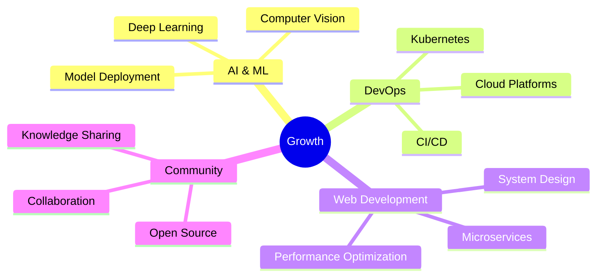

# 🌟 Amirhossein Malekipour

<div align="center">

[](https://git.io/typing-svg)

</div>

<div align="center">
  
  
  
</div>

---

## 💫 About Me

```typescript
const amirhossein = {
    role: "Full-Stack Web Developer",
    location: "🌍 Earth",
    currentFocus: ["Web Development", "AI/ML", "DevOps"],
    learning: ["Computer Vision", "Kubernetes", "System Design"],
    motto: "Code, Learn, Build, Repeat 🔁"
};
```


- 🔭 Building **scalable web applications**
- 🌱 Exploring **AI/ML** with Python
- 🚀 Diving into **DevOps** practices
- 💡 Turning ideas into **reality**
- 📚 Constantly **learning** and **growing**

<br clear="right"/>

---

## 🛠️ Tech Arsenal

<div align="center">

### 💻 Frontend


### ⚙️ Backend


### 🗄️ Databases


### 🔧 DevOps & Tools


### 🤖 AI/ML


</div>

---

## 📊 GitHub Statistics

<div align="center">
  
  
  
  

</div>

<div align="center">
  
  
  
</div>

<div align="center">
  
  
  
</div>

---

## 🏆 Featured Projects

<div align="center">

<table>
<tr>
<td width="50%">

### 🌐 Full-Stack Web Application


**Complete web solution** with React frontend & Node.js backend
- 🔐 Advanced authentication system
- 🎨 Modern, responsive UI/UX
- 📡 RESTful API architecture
- ☁️ Cloud deployment ready

**Tech:** `React` `Node.js` `MongoDB` `Docker`

</td>
<td width="50%">

### 🤖 AI/ML Playground


**Machine Learning experiments** & applications
- ⚽ Football match predictions
- 📄 OCR & text recognition
- 🧠 Neural network models
- 📊 Data visualization

**Tech:** `Python` `TensorFlow` `OpenCV` `FastAPI`

</td>
</tr>
<tr>
<td width="50%">

### 🐳 DevOps Automation


**Modern DevOps practices** implementation
- 📦 Dockerized applications
- 🔄 CI/CD pipelines
- 🚀 Automated deployments
- 📈 Monitoring & logging

**Tech:** `Docker` `GitHub Actions` `Nginx` `Linux`

</td>
<td width="50%">

### 🎯 More Coming Soon...


**Exciting projects** in the pipeline
- 🌟 Open source contributions
- 💡 Innovative web apps
- 🔧 Developer tools
- 📚 Educational content

**Stay tuned! ** ⭐

</td>
</tr>
</table>

</div>

---

## 🌱 Current Focus

<div align="center">



</div>

---

## 📈 Contribution Graph

<div align="center">
  
  
  
</div>

---

## 🎯 2025 Goals

<div align="center">

| Goal | Status | Progress |
|------|--------|----------|
| 🚀 Launch 5 major projects | 🟡 In Progress | ████░░░░░░ 40% |
| 📚 Master Kubernetes | 🟢 On Track | ███░░░░░░░ 30% |
| 🤝 100+ Open Source Contributions | 🟢 On Track | ██░░░░░░░░ 20% |
| 🎓 Complete AI/ML Course | 🟡 In Progress | █████░░░░░ 50% |
| 💼 Build Personal Brand | 🟢 On Track | ██████░░░░ 60% |

</div>

---

## 🤝 Let's Connect

<div align="center">

[](https://www.linkedin.com/in/your-link)
[](https://your-website.com)
[](https://github.com/malekipourdev)
[](mailto:your-email@gmail. com)
[](https://twitter.com/your-handle)

</div>

---

<div align="center">

### 💭 Quote of the Day


</div>

---

<div align="center">

### 🎵 Now Playing on Spotify

[](https://open.spotify.com/user/your-spotify-id)

</div>

---

<div align="center">

### ☕ Support My Work

[](https://www.buymeacoffee.com/your-username)
[](https://ko-fi.com/your-username)

</div>

---

<div align="center">
  
  **💙 Thanks for visiting!  Let's build something amazing together!  🚀**
  
  
  
  ⭐ From [malekipourdev](https://github.com/malekipourdev) with ❤️
  
</div>
